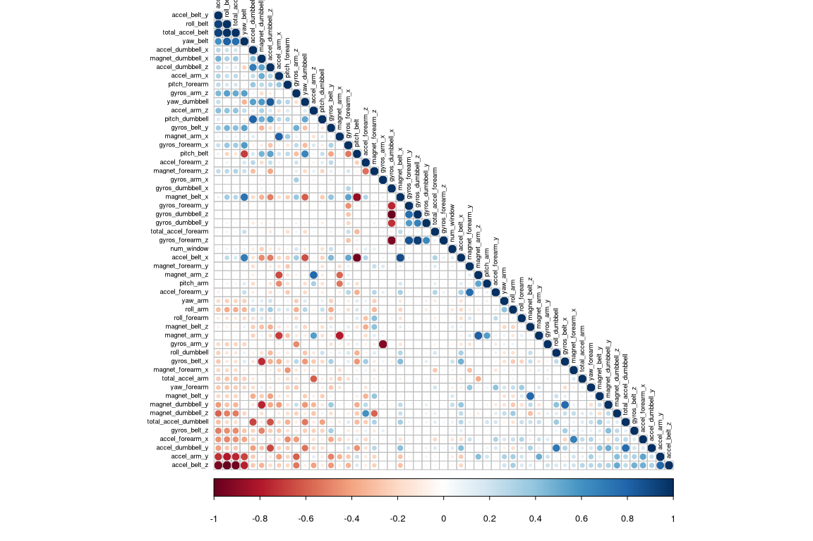
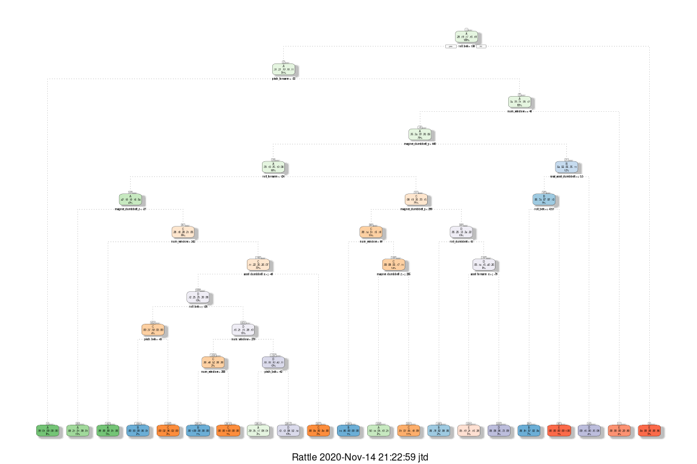
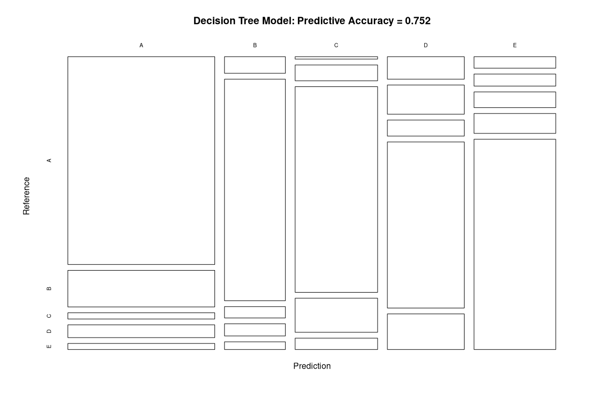

## Summary

This document is the final report of the Peer Assessment project from the Practical Machine Learning course, which is a part of the Coursera John's Hopkins University Data Science Specialization. It was written and coded in RStudio, using its knitr functions and published in the html and markdown format. The goal of this project is to predict the manner in which the six participants performed the exercises. The machine learning algorithm, which uses the classe variable in the training set, is applied to the 20 test cases available in the test data.

## Introduction

Using devices such as Jawbone Up, Nike FuelBand, and Fitbit it is now possible to collect a large amount of data about personal activity relatively inexpensively. These type of devices are part of the quantified self movement – a group of enthusiasts who take measurements about themselves regularly to improve their health, to find patterns in their behavior, or because they are tech geeks. One thing that people regularly do is quantify how much of a particular activity they do, but they rarely quantify how well they do it. In this project, your goal will be to use data from accelerometers on the belt, forearm, arm, and dumbell of 6 participants. They were asked to perform barbell lifts correctly and incorrectly in 5 different ways. 

More information is available from the website here: http://groupware.les.inf.puc-rio.br/har.

## Data Source

The training and test data for this project are collected using the link below:

https://d396qusza40orc.cloudfront.net/predmachlearn/pml-training.csv

https://d396qusza40orc.cloudfront.net/predmachlearn/pml-testing.csv

The data for this project come from this source: http://groupware.les.inf.puc-rio.br/har. 

The full reference of this data is as follows:

Velloso, E.; Bulling, A.; Gellersen, H.; Ugulino, W.; Fuks, H. __“Qualitative Activity Recognition of Weight Lifting Exercises. Proceedings of 4th International Conference in Cooperation with SIGCHI (Augmented Human ’13)”__. Stuttgart, Germany: ACM SIGCHI, 2013.

## Loading and Cleaning of Data

Set working directory.


Load required R packages and set a seed.


Load data for training and test datasets.


```
## [1] 19622   160
```

```
## [1]  20 160
```

Create two partitions (75% and 25%) within the original  training dataset.


```
## [1] 14718   160
```

```
## [1] 4904  160
```

The two datasets (`train_set` and `test_set`) have a large number of `NA` values as well as near-zero-variance (NZV) variables. Both will be removed together with their ID variables.


```
## [1] 14718   120
```

```
## [1] 4904  120
```

Remove variables that are mostly NA. A threshlod of 95 % is selected.


```
## [1] 14718    59
```

```
## [1] 4904   59
```

Since columns 1 to 5 are identification variables only, they will be removed as well.


```
## [1] 14718    54
```

```
## [1] 4904   54
```

The number of variables for the analysis has been reduced from the original 160 down to 54.

## Correlation Analysis

Correlation analysis between the variables before the modeling work itself is done. The “FPC” is used as the first principal component order.

<!-- -->

If two variables are highly correlated their colors are either dark blue (for a positive correlation) or dark red (for a negative correlations). Because there are only few strong correlations among the input variables, the Principal Components Analysis (PCA) will not be performed in this analysis. Instead, a few different prediction models will be built to have a better accuracy.

## Prediction Models

### Decision Tree Model

<!-- -->

Predictions of the decision tree model on `test_set`.


```
## Confusion Matrix and Statistics
## 
##           Reference
## Prediction    A    B    C    D    E
##          A 1238  218   37   76   36
##          B   41  547   28   30   19
##          C    8   53  688  114   38
##          D   70   91   50  518  111
##          E   38   40   52   66  697
## 
## Overall Statistics
##                                           
##                Accuracy : 0.752           
##                  95% CI : (0.7397, 0.7641)
##     No Information Rate : 0.2845          
##     P-Value [Acc > NIR] : < 2.2e-16       
##                                           
##                   Kappa : 0.685           
##                                           
##  Mcnemar's Test P-Value : < 2.2e-16       
## 
## Statistics by Class:
## 
##                      Class: A Class: B Class: C Class: D Class: E
## Sensitivity            0.8875   0.5764   0.8047   0.6443   0.7736
## Specificity            0.8954   0.9702   0.9474   0.9215   0.9510
## Pos Pred Value         0.7713   0.8226   0.7636   0.6167   0.7805
## Neg Pred Value         0.9524   0.9052   0.9583   0.9296   0.9491
## Prevalence             0.2845   0.1935   0.1743   0.1639   0.1837
## Detection Rate         0.2524   0.1115   0.1403   0.1056   0.1421
## Detection Prevalence   0.3273   0.1356   0.1837   0.1713   0.1821
## Balanced Accuracy      0.8914   0.7733   0.8760   0.7829   0.8623
```

The predictive accuracy of the decision tree model is relatively low at `75.2 %`.

Plot the predictive accuracy of the decision tree model.

<!-- -->

### Generalized Boosted Model (GBM)


```
## A gradient boosted model with multinomial loss function.
## 150 iterations were performed.
## There were 53 predictors of which 52 had non-zero influence.
```

Predictions of the GBM on `test_set`.


```
## Confusion Matrix and Statistics
## 
##           Reference
## Prediction    A    B    C    D    E
##          A 1392    6    0    1    0
##          B    3  927    4    3    3
##          C    0   12  842   12    2
##          D    0    4    9  786    9
##          E    0    0    0    2  887
## 
## Overall Statistics
##                                          
##                Accuracy : 0.9857         
##                  95% CI : (0.982, 0.9889)
##     No Information Rate : 0.2845         
##     P-Value [Acc > NIR] : < 2.2e-16      
##                                          
##                   Kappa : 0.9819         
##                                          
##  Mcnemar's Test P-Value : NA             
## 
## Statistics by Class:
## 
##                      Class: A Class: B Class: C Class: D Class: E
## Sensitivity            0.9978   0.9768   0.9848   0.9776   0.9845
## Specificity            0.9980   0.9967   0.9936   0.9946   0.9995
## Pos Pred Value         0.9950   0.9862   0.9700   0.9728   0.9978
## Neg Pred Value         0.9991   0.9945   0.9968   0.9956   0.9965
## Prevalence             0.2845   0.1935   0.1743   0.1639   0.1837
## Detection Rate         0.2838   0.1890   0.1717   0.1603   0.1809
## Detection Prevalence   0.2853   0.1917   0.1770   0.1648   0.1813
## Balanced Accuracy      0.9979   0.9868   0.9892   0.9861   0.9920
```

The predictive accuracy of the GBM is relatively high at `98.57 %`.

### Random Forest Model


```
## 
## Call:
##  randomForest(x = x, y = y, mtry = param$mtry, verbose = FALSE) 
##                Type of random forest: classification
##                      Number of trees: 500
## No. of variables tried at each split: 27
## 
##         OOB estimate of  error rate: 0.24%
## Confusion matrix:
##      A    B    C    D    E  class.error
## A 4183    1    0    0    1 0.0004778973
## B    8 2836    3    1    0 0.0042134831
## C    0    6 2561    0    0 0.0023373588
## D    0    0    7 2404    1 0.0033167496
## E    0    1    0    7 2698 0.0029563932
```

Predictions of the random forest model on `test_set`.


```
## Confusion Matrix and Statistics
## 
##           Reference
## Prediction    A    B    C    D    E
##          A 1395    3    0    0    0
##          B    0  946    2    0    0
##          C    0    0  853    6    0
##          D    0    0    0  798    1
##          E    0    0    0    0  900
## 
## Overall Statistics
##                                           
##                Accuracy : 0.9976          
##                  95% CI : (0.9957, 0.9987)
##     No Information Rate : 0.2845          
##     P-Value [Acc > NIR] : < 2.2e-16       
##                                           
##                   Kappa : 0.9969          
##                                           
##  Mcnemar's Test P-Value : NA              
## 
## Statistics by Class:
## 
##                      Class: A Class: B Class: C Class: D Class: E
## Sensitivity            1.0000   0.9968   0.9977   0.9925   0.9989
## Specificity            0.9991   0.9995   0.9985   0.9998   1.0000
## Pos Pred Value         0.9979   0.9979   0.9930   0.9987   1.0000
## Neg Pred Value         1.0000   0.9992   0.9995   0.9985   0.9998
## Prevalence             0.2845   0.1935   0.1743   0.1639   0.1837
## Detection Rate         0.2845   0.1929   0.1739   0.1627   0.1835
## Detection Prevalence   0.2851   0.1933   0.1752   0.1629   0.1835
## Balanced Accuracy      0.9996   0.9982   0.9981   0.9961   0.9994
```

The predictive accuracy of the Random Forest model is excellent at `99.8 %`.

## Applying the Best Predictive Model to the Test Data

The following are the predictive accuracy of the three models:

  * Decision Tree Model: __75.20 %__
  * Generalized Boosted Model: __98.57 %__
  * Random Forest Model: __99.80 %__
  
The Random Forest model is selected and applied to make predictions on the 20 data points from the original testing dataset (data_quiz).


```
##    1:20 predict(fit_RF, newdata = data_quiz)
## 1     1                                    B
## 2     2                                    A
## 3     3                                    B
## 4     4                                    A
## 5     5                                    A
## 6     6                                    E
## 7     7                                    D
## 8     8                                    B
## 9     9                                    A
## 10   10                                    A
## 11   11                                    B
## 12   12                                    C
## 13   13                                    B
## 14   14                                    A
## 15   15                                    E
## 16   16                                    E
## 17   17                                    A
## 18   18                                    B
## 19   19                                    B
## 20   20                                    B
```

